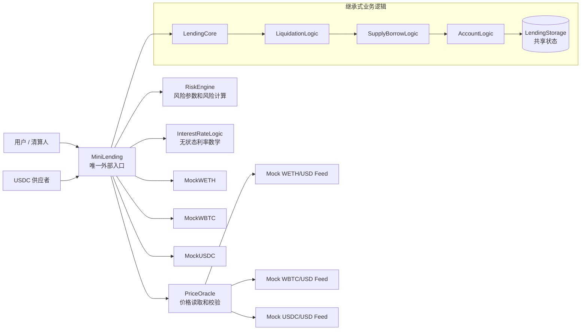

# Mini Lending Protocol

一个基于 Solidity + Foundry 的迷你超额抵押借贷协议。项目目标不是完整复刻 Aave 或 Compound，而是用较小代码量覆盖借贷协议最核心的风险链路：抵押、供应、借款、利息、健康因子、清算、坏账和账本一致性。

当前版本支持：

- 抵押资产：MockWETH、MockWBTC。
- 借款和供应资产：MockUSDC。
- Aave 风格风险模型：健康因子、清算阈值、清算奖励、close factor、permissionless liquidation。
- Compound III 风格架构：多抵押资产、单一 base asset、`absorb / buyCollateral` 两阶段清算。
- 风险控制：supply cap、global borrow cap、WBTC isolation mode、pause、asset freeze。
- 利息和会计：USDC 供应池、`borrowIndex` / `supplyIndex`、utilization kink rate、10% reserve factor、坏账记录和再资本化。
- Oracle：Chainlink-style mock feed、feed decimals 归一化、stale price 检查、按资产 heartbeat。
- 测试：unit、fuzz、invariant，共 98 个 Foundry 测试通过。

## 架构



协议不是 proxy/router 架构，`MiniLending` 是唯一外部入口。核心业务通过继承式 `logic/` 层拆分，并共享 `LendingStorage` 中的状态：

```text
MiniLending
  -> LendingCore
    -> LiquidationLogic
      -> SupplyBorrowLogic
        -> AccountLogic
          -> LendingStorage
```

- `MiniLending`：用户交互入口，负责外部参数校验、调用 `accrueInterest()` 和调度内部逻辑。
- `LendingStorage`：共享状态根，集中保存协议常量、状态变量、事件和 modifier。
- `src/logic/`：stateful internal logic，可读写 `LendingStorage`，不是独立部署合约。
- `RiskEngine`：独立依赖合约，保存资产风险参数并计算可借额度、清算阈值和清算可得抵押品。
- `PriceOracle`：独立依赖合约，读取 Chainlink-style feed，检查价格有效性，并统一转换为 1e18 价格精度。
- `src/libraries/`：无状态数学工具，目前 `InterestRateLogic` 负责 utilization、kink rate、index 和 principal 换算。
- `src/mocks/`：测试和本地部署用 mock token / mock price feed。

## 核心机制

### 账户风险

```text
borrowableUsd = sum(collateralValueUsd * collateralFactorBps / 10000)
healthFactor = adjustedCollateralUsd * 1e18 / debtUsd
adjustedCollateralUsd = sum(collateralValueUsd * liquidationThresholdBps / 10000)
```

借款和赎回后，账户健康因子必须大于等于 `1e18`。当健康因子低于 `1e18` 时，账户可以被清算。

### 供应池和利息

MockUSDC 不是协议预置资金，而是由供应者通过 `supplyBase` 存入。借款人只能从可用流动性中借出 MockUSDC。

利息使用全局 index 累计，避免遍历用户：

```text
debtUsdc(user) = userBorrowPrincipal * currentBorrowIndex / 1e18
suppliedUsdc(user) = userSupplyPrincipal * currentSupplyIndex / 1e18
```

借款利率由 utilization-based kink model 决定。借款利息中 90% 进入 `supplyIndex`，10% 进入 `protocolReservesUsdc`。

### 清算和坏账

协议支持两条清算路径：

- `liquidate`：清算人替 borrower 偿还 MockUSDC，并获得带 10% bonus 的抵押品；单次最多偿还当前债务的 50%。
- `absorb / buyCollateral`：协议先吸收不健康账户，把债务清零并接收抵押品；第三方再用 MockUSDC 折价购买协议持有的抵押品。

如果折价可回收抵押品不足以覆盖债务，协议先使用 `protocolReservesUsdc`，不足部分记录到 `badDebtUsdc`。任何地址都可以调用 `recapitalizeBadDebt` 注入 MockUSDC 降低坏账。

## 风险参数

| 资产 | Collateral Factor | Liquidation Threshold | Liquidation Bonus | Supply Cap | Isolation | Debt Ceiling |
| --- | ---: | ---: | ---: | ---: | ---: | ---: |
| WETH | 75% | 80% | 10% | 10,000 WETH | No | - |
| WBTC | 70% | 75% | 10% | 1,000 WBTC | Yes | 20,000 USD |

协议常量：

```text
BPS = 10_000
WAD = 1e18
MIN_HEALTH_FACTOR = 1e18
CLOSE_FACTOR_BPS = 5_000
KINK_UTILIZATION = 80%
RESERVE_FACTOR_BPS = 1_000
GLOBAL_BORROW_CAP_USDC = 9,000,000 USDC
```

精度约定：

| 数值 | 精度 |
| --- | --- |
| WETH | 18 decimals |
| WBTC | 8 decimals |
| USDC | 6 decimals |
| Oracle 价格 | 1e18 |
| USD 价值 / 健康因子 | 1e18 |

## 测试

```text
forge test
98 tests passed, 0 failed
```

测试覆盖：

- Unit tests：deposit、supply、borrow、repay、withdraw、liquidation、absorb、buyCollateral、caps、isolation、pause、freeze、reserve、bad debt、interest、rate、oracle。用例已按核心流程合并，避免为同一行为拆分过多重复断言。
- Fuzz tests：借款上限、健康因子、价格下跌、清算奖励、USDC decimals。
- Invariant tests：抵押品账实一致、base pool 偿付能力、债务账本一致、健康仓位不能被清算、成功 borrow/withdraw 后账户保持健康。

静态分析：

```text
slither .
```

已根据 Slither 结果补充事件、immutable 依赖、Oracle round 完整性检查和 storage/logic 分层说明。剩余项主要是 timestamp、定点数取整、有限资产数组遍历和 reentrancy-events 等设计性提示，详见 [docs/audit-notes.md](docs/audit-notes.md)。

## 运行

```bash
forge build
forge test
forge test --match-contract MiniLendingFuzzTest
forge test --match-contract MiniLendingInvariantTest
forge script script/Deploy.s.sol
```

部署脚本会创建 mock WETH、mock WBTC、mock USDC、mock price feeds、oracle、risk engine 和 lending contract，并通过 `supplyBase` 存入初始 MockUSDC 流动性。

## 文档

- [设计说明](docs/design.md)
- [风险参数](docs/risk-parameters.md)
- [利息模型](docs/interest-model.md)
- [清算流程](docs/liquidation-flow.md)
- [审计备注](docs/audit-notes.md)

## 已知限制

- 仅支持 MockWETH / MockWBTC 抵押和 MockUSDC 单一借款资产。
- 没有 aToken/cToken、闪电贷、多借款资产、治理 timelock、可升级代理和前端。
- 没有抵押品 auction 管理流程。
- 没有接入真实 Chainlink feed 地址。
- 当前 mock ERC20 不会 callback；
