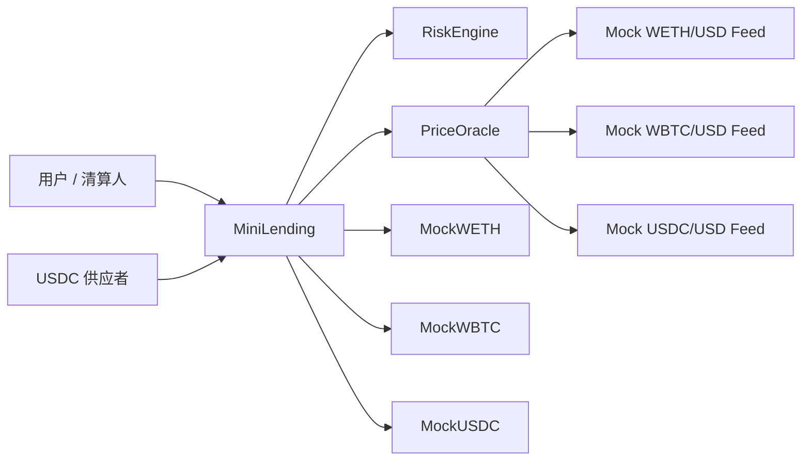

# Mini Lending Protocol

一个基于 Solidity + Foundry 的迷你超额抵押借贷协议。项目定位不是完整复刻 Aave 或 Compound，而是把两者最适合学习和展示的核心机制组合起来：

- Aave 风格：健康因子、清算阈值、清算奖励、permissionless liquidation。
- Compound III 风格：多抵押资产、单一借款资产 MockUSDC、base asset pool、absorb / buyCollateral 两阶段清算。

当前版本支持 WETH/WBTC 抵押、MockUSDC 供应池、MockUSDC 借款、还款、赎回、Chainlink-style mock oracle、健康因子、borrow/supply index 利息累计、supply cap、global borrow cap、close factor、清算奖励、协议吸收坏仓位、折价出售协议抵押品、坏账记录、unit/fuzz/invariant 测试、CI 和部署脚本。

## 架构



## 当前功能

- 用户可以存入 WETH 或 WBTC 作为抵押品。
- 每个抵押资产都有 supply cap，限制协议对单一抵押品的集中暴露。
- USDC 供应者可以通过 `supplyBase` 存入 MockUSDC。
- USDC 供应者可以通过 `withdrawBase` 赎回可用流动性。
- 用户可以按照 collateral factor 和资金池可用流动性借出 MockUSDC。
- 协议有全局 MockUSDC borrow cap，限制 base asset 总借款规模。
- 用户可以部分还款或全额还款。
- 用户可以赎回抵押品，但赎回后健康因子必须仍然大于等于 `1e18`。
- 协议可以计算账户总抵押价值、可借额度、债务价值和健康因子。
- 借款债务通过 `borrowIndex` 随时间累计。
- 供应者收益通过 `supplyIndex` 随借款利息累计。
- 借款利率通过 utilization-based kink model 计算。
- 协议收取 10% reserve factor 作为储备金。
- 协议可以计算 base asset pool utilization。
- 当账户健康因子低于 `1e18` 时，第三方可以发起清算。
- 每次清算最多偿还当前债务的 50%。
- 清算人可以获得 10% liquidation bonus。
- 协议可以通过 `absorb` 吸收不健康账户，把债务清零并把抵押品转入协议账本。
- 第三方可以通过 `buyCollateral` 用 MockUSDC 折价购买协议持有的抵押品。
- 当折价抵押品不足以覆盖债务时，协议会优先使用 reserves，再记录 `badDebtUSDC`。
- Oracle 价格统一转换成 `1e18` 精度。
- 测试覆盖 WETH 18 位小数、WBTC 8 位小数、USDC 6 位小数和 price feed 小数位转换。

## 风险参数

| 资产 | Collateral Factor | Liquidation Threshold | Liquidation Bonus | Supply Cap |
| --- | ---: | ---: | ---: | ---: |
| WETH | 75% | 80% | 10% | 10,000 WETH |
| WBTC | 70% | 75% | 10% | 1,000 WBTC |

协议常量：

```text
BPS = 10_000
WAD = 1e18
MIN_HEALTH_FACTOR = 1e18
CLOSE_FACTOR_BPS = 5_000
KINK_UTILIZATION = 80%
RESERVE_FACTOR_BPS = 1_000
GLOBAL_BORROW_CAP_USDC = 9,000,000 USDC
```

## 精度约定

| 数值 | 精度 |
| --- | --- |
| Token 数量 | 使用 token 自身 decimals |
| Oracle 价格 | 统一转换成 1e18 |
| USD 价值 | 1e18 |
| 健康因子 | 1e18 |

抵押品 USD 价值：

```text
tokenAmount * assetPriceE18 / 10 ** tokenDecimals
```

USDC 债务 USD 价值：

```text
usdcAmount * usdcPriceE18 / 10 ** 6
```

## 健康因子

```text
healthFactor = adjustedCollateralUsd * 1e18 / debtUsd
```

其中：

```text
adjustedCollateralUsd = sum(collateralValueUsd * liquidationThresholdBps / 10000)
```

当健康因子低于 `1e18` 时，账户进入可清算状态。

## USDC 供应池和利息

MockUSDC 不再由协议直接预置给 borrower，而是通过 base asset pool 供应：

```text
Lender supplyBase USDC -> 协议形成可借流动性
Borrower borrow USDC -> 协议现金下降，totalBorrowedUSDC 上升
Borrower repay USDC -> 协议现金回升，债务下降
```

利息使用全局 index 结算，不循环更新所有用户：

```text
borrowRate = f(utilization)
borrowIndex = borrowIndex * (1 + borrowRate * elapsed)
userDebt = userBorrowPrincipal * currentBorrowIndex / 1e18
supplierBalance = userSupplyPrincipal * currentSupplyIndex / 1e18
```

当前版本使用 utilization-based kink rate model：

```text
utilization <= 80%:
    rate = baseRate + utilization * slopeLow
utilization > 80%:
    rate = baseRate + 80% * slopeLow + (utilization - 80%) * slopeHigh
```

借款利息按 90% / 10% 分配：

```text
90% -> supplyIndex，增加供应者可领取余额
10% -> protocolReservesUSDC，作为协议储备金
```

## 清算例子

```text
Alice 抵押 1 WETH
WETH 价格 = 3000 USD
Alice 借出 2000 USDC
健康因子 = 3000 * 80% / 2000 = 1.2
```

此时 Alice 是健康仓位。

如果 WETH 下跌：

```text
WETH 价格 = 2000 USD
健康因子 = 2000 * 80% / 2000 = 0.8
```

Alice 进入可清算状态。

Bob 发起清算：

```text
Bob 替 Alice 偿还 1000 USDC
Liquidation bonus = 10%
Bob 可以拿走价值 1100 USD 的 WETH
Seized WETH = 1100 / 2000 = 0.55 WETH
```

最终状态：

```text
Alice debt: 2000 -> 1000 USDC
Alice collateral: 1 -> 0.45 WETH
Bob receives: 0.55 WETH
```

## Absorb / Buy Collateral

项目同时保留 Compound III 风格的两阶段清算路径：

```text
absorb(borrower)
  协议吸收不健康账户，borrower debt 归零，borrower collateral 转入 protocolCollateralBalance。

buyCollateral(asset, amountUSDC, minCollateralAmount)
  买家用 USDC 从协议折价购买已吸收的抵押品。
```

以 Alice 的坏仓位为例：

```text
Alice debt = 2000 USDC
Alice collateral = 1 WETH
WETH price = 2000 USD
Liquidation bonus = 10%
```

协议吸收后，1 WETH 进入协议抵押品账本。由于协议后续会按 10% bonus 对外出售抵押品，1 WETH 的折价可回收价值约为：

```text
2000 / 1.1 = 1818.18 USDC
badDebt = 2000 - 1818.18 = 181.82 USDC
```

这让项目可以同时解释 Aave 的直接清算和 Compound III 的协议吸收再出售抵押品模型。

## 仓库结构

```text
src/
  MiniLending.sol
  PriceOracle.sol
  RiskEngine.sol
  interfaces/
  mocks/
test/
  PriceOracle.t.sol
  MiniLending.deposit.t.sol
  MiniLending.borrow.t.sol
  MiniLending.repay.t.sol
  MiniLending.withdraw.t.sol
  MiniLending.liquidation.t.sol
  MiniLending.absorb.t.sol
  MiniLending.caps.t.sol
  MiniLending.supply.t.sol
  MiniLending.interest.t.sol
  MiniLending.rate.t.sol
  MiniLending.fuzz.t.sol
  MiniLending.invariant.t.sol
script/
  Deploy.s.sol
docs/
  design.md
  risk-parameters.md
  liquidation-flow.md
  interest-model.md
  audit-notes.md
  extension-roadmap.md
```

## 测试

当前测试体系：

```text
Unit tests: deposit / supply / borrow / repay / withdraw / liquidation / absorb / buyCollateral / caps / interest / rate / oracle
Fuzz tests: borrow limit / liquidation amount / price movement / decimal handling
Invariant tests: collateral accounting / base pool solvency / debt accounting / healthy liquidation rejection / health factor constraints
```

本地测试结果：

```text
forge test
117 tests passed, 0 failed
```

覆盖率结果：

```text
forge coverage
Total line coverage: 87.60%
Total statement coverage: 88.74%
Total function coverage: 92.78%
```

## 运行方式

```bash
forge build
forge test
forge test --match-contract MiniLendingLiquidationTest -vvvv
forge test --match-contract MiniLendingFuzzTest
forge test --match-contract MiniLendingInvariantTest
```

仓库内置了一个轻量 `forge-std` 兼容 shim，因此在受限网络环境里也可以编译和测试。

## 本地部署

```bash
forge script script/Deploy.s.sol
```

部署脚本会创建 mock WETH、mock WBTC、mock USDC、mock price feeds、oracle、risk engine 和 lending contract，并通过 `supplyBase` 存入初始 MockUSDC 流动性。

## 已知限制

- 没有多借款资产。
- 没有 aToken/cToken 形式的凭证 token。
- 没有闪电贷。
- 没有治理和 timelock。
- 坏账只做 accounting，没有单独的 recapitalization、auction 或 reserve withdraw 管理流程。
- 没有前端。
- 没有真实 Chainlink feed 地址。

## 后续扩展方向

这个项目最适合继续扩成一个 “Aave 风险模型 + Compound III 单一 base asset + 简化 reserve/liquidation flow” 的作品。

优先级建议：

1. 加入 isolation mode、price heartbeat、pause/freeze 等更细的风险控制。
2. 增加 keeper 脚本，自动扫描 HF < 1 的账户并执行 liquidate 或 absorb。
3. 增加 fork test，读取真实 Chainlink feed 并验证 decimals / stale period。
4. 加入 reserve withdraw、bad debt recapitalization 或 auction 模块。

更详细路线见 [docs/extension-roadmap.md](docs/extension-roadmap.md)。
